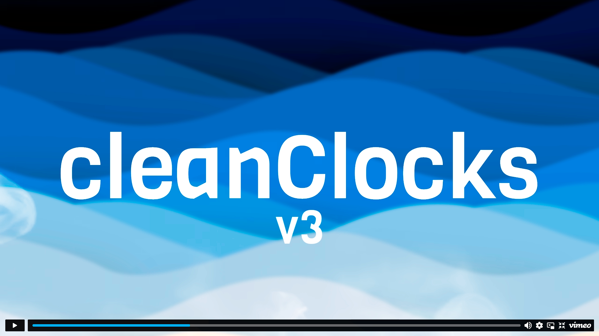
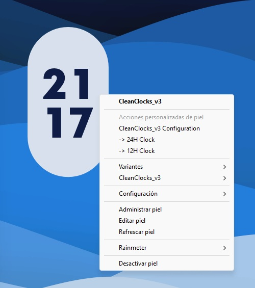
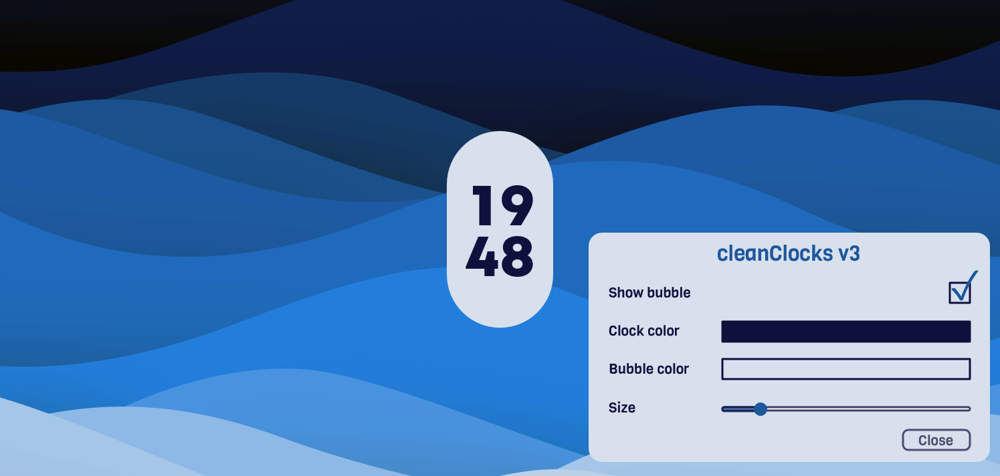

Simple and clean clock skin collection for Rainmeter including 10 different variants.
Version 3.0 has added the new configuration window where you can easily change colors
using the color picker, enable or disable the bubble and change its size with the slider.

Installation Guide:
==========================================================================================
1. Install Rainmeter on your computer (you can find it here: https://www.rainmeter.net/)
2. Download the .rmskin file from this repository (Current version: cleanClocks_v3.1.rmskin)
3. Install the skin by just double clicking the .rmskin file and follow the install wizard

Quick Guide of Use:
==========================================================================================
1. To open the context menu, right click on the skin. It shoud show you a dropdown menu
with the following options:

   a) CleanClocks_v3 Configuration --> Opens or closes the "Configuration Window", there
you can:
      - Enable or disable the clock's bubble by clicking the checkbox
      - Change the clock's or bubble's color by clicking the colored rectangles (this will
open the color picker)
      - Change the clock's size by sliding left or right the blue ball on the slider 
(changes in size are applied the moment you release the left mouse button)

   b) -> 24H Clock --> Changes the clock format to 24H
   c) -> 12H Clock --> Changes the clock format to 12H
  
2. You can move the skin wherever you like on your desktop (if you want, you can check 
the Mouse Transparent option in the Rainmeter Management Window)

I hope you like this simple project, cheers!

If you are interested in the wallpapers shown in the pictures, you can check them out on my
DevianArt profile (https://www.deviantart.com/javigalan99/gallery/94215437/walpapers) ;)
